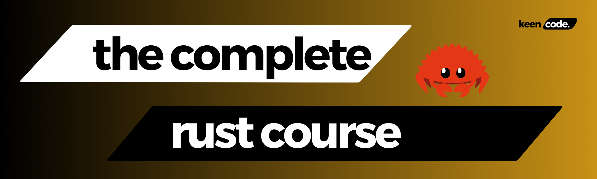

Find me:

### Introduction to Rust Programming Course (From Beginner to Expert)

Welcome to our Rust Programming Course! Whether you're a seasoned developer looking to expand your programming repertoire or a complete beginner eager to dive into the world of systems programming, this course is designed to guide you through the fundamentals and advanced features of Rust.

**Why Rust?**

Rust is a modern systems programming language that combines performance with safety. It's designed to help you write fast and reliable software with a focus on three key goals:

1. **Performance:** Rust programs are blazing fast and memory-efficient, with no runtime or garbage collector, making it a great choice for high-performance applications.
2. **Reliability:** Rust’s rich type system and ownership model guarantee memory safety and thread safety, enabling you to eliminate many classes of bugs at compile time.
3. **Productivity:** With a great package manager (Cargo), friendly compiler, and useful documentation, Rust is also designed to be an ergonomic programming language for developers.

**Course Overview**

Our course is structured to be comprehensive and engaging, covering everything from the basics to advanced topics. Here's a brief outline of what you'll learn:

1. **Introduction to Rust:**
   - Understanding Rust’s philosophy and core principles.
   - Setting up your development environment.
   - Writing your first Rust program.

2. **Basic Syntax and Concepts:**
   - Variables and data types.
   - Control flow (if, match, loops).
   - Functions and modules.

3. **Ownership and Borrowing:**
   - Understanding Rust’s ownership model.
   - Borrowing and references.
   - Lifetimes and how they ensure memory safety.

4. **Collections and Error Handling:**
   - Working with vectors, strings, and hash maps.
   - Handling errors with Result and Option.

5. **Advanced Topics:**
   - Concurrency in Rust.
   - Using Traits and Generics.
   - Building and testing a Rust project.

6. **Practical Projects:**
   - Applying what you’ve learned in real-world scenarios.
   - Building a command-line tool.
   - Creating a web server with Actix or Rocket.

**Who is This Course For?**

This course is for anyone who wants to learn Rust, from complete beginners to experienced developers. If you're looking to build high-performance applications, systems software, or just want to explore a new language that emphasizes safety and concurrency, this course is for you.

**How to Make the Most Out of This Course**

- **Code Along:** Follow along with the examples and write code yourself. Hands-on practice is crucial to mastering Rust.
- **Ask Questions:** Engage with the community. Don’t hesitate to ask questions in the comments section or join our dedicated Rust community forum.
- **Experiment:** Don’t be afraid to experiment with the code. Try out different things, break stuff, and learn from your mistakes.
- **Stay Consistent:** Programming is a skill best developed over time. Try to dedicate a consistent time slot each day or week to learning Rust.

---
Feel free to customize the introduction to suit your course's specific goals and target audience. Good luck with your Rust course!

## Course Content

Section 1: Installation and Setup environment

1. [Course Introduction](https://youtu.be/okSfHtqWu5c)
2. [Installation - Windows, Linux and MacOs](https://youtu.be/8X1irEQpf9c)
3. [VS Code Setup for Rust Development](https://youtu.be/Vne_hcBW3k4)

Section 2: Basics of Rust

1. [Hello World!](https://youtu.be/AM52WkNoqS4)
2. [Variables & Mutability](https://youtu.be/JXKpGkYdCAE)

Important: If you found any issue/typo. Please feel free to riase a PR.

Happy coding! 🖥️✨

## Explore other resources :

